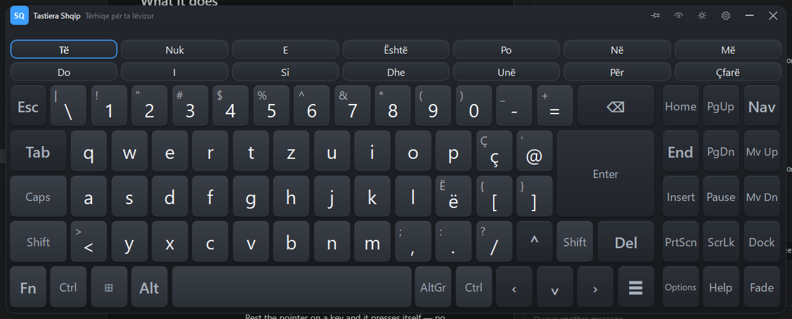

# Tastiera Shqip — Albanian on-screen keyboard with word prediction

A Windows on-screen keyboard for Albanian that types into **any** application and
predicts both the word being written and the word that comes next. It is built
for people who type slowly or with difficulty, where every keystroke saved is
the point.



## What it does

**Types everywhere.** Keystrokes are injected with `SendInput`, so Word, Chrome,
Outlook, WhatsApp Desktop, Notepad and the rest all receive ordinary keyboard
input. The keyboard never takes focus (`WS_EX_NOACTIVATE`), so the text cursor
stays where you are writing.

**Writes Albanian without the Albanian layout.** Characters are sent as Unicode
rather than as layout-dependent key codes, so **Ë** and **Ç** come out correctly
even on a machine set to the US layout.

**Predicts words and next words.** A trigram model trained on ~30 million words
of Albanian offers completions as you type and predicts the following word after
each space, across one to three rows of suggestions.

**Adapts to you.** Every word you write is folded into a personal model, so your
name, your town and the phrases you use most rise to the top. It is stored only
on your machine, in `%APPDATA%\ShqipKeyboard`, and can be erased from Options.

**Goes where you want it.** Drag the top strip to move it, drag any edge or
corner to resize it, double-click the strip to dock or release it. Dark and light
themes, four accent colours, adjustable text size and opacity.

**Opens immediately.** The window is on screen in under half a second; the
dictionary loads behind it and the suggestions light up when it is ready.

## Accessibility

| Feature | Why it is there |
|---|---|
| **Dwell selection** | Rest the pointer on a key and it presses itself — no click needed. For head mice, eye trackers and joysticks. |
| **Sticky modifiers** | Shift/Ctrl/Alt/AltGr latch: press once for the next key, twice to lock, three times to release. Ctrl+C with one finger. |
| **Hold to repeat** | Holding Backspace deletes continuously instead of demanding forty clicks. |
| **No diacritics needed** | `shqiperi` offers `Shqipëri`. Hunting for Ë costs a slow typist real time. |
| **Typo tolerance** | A doubled or transposed letter still finds the word — the errors tremor produces. |
| **One to three prediction rows** | More rows means more words offered without hunting; fewer means less of the screen taken. Yours to choose. |
| **Light theme** | An opaque dark slab over a white document is tiring to read past, and higher contrast suits some low-vision users. |
| **Four accent colours** | The accent marks hover, press and dwell progress — load-bearing signals somebody with colour vision deficiency may not otherwise distinguish. |
| **Adjustable size, opacity, dwell time** | All in Options. Legends shrink to fit their key, so a large text size does not clip `Options` to `Optio`. |

## Requirements

- Windows 10 or 11
- Python 3.10+

## Install and run

```powershell
pip install -r requirements.txt
python main.py
```

The keyboard docks to the bottom of the screen. It has no taskbar button; use
the tray icon near the clock to show it again after hiding, or to quit.

## Layout

The layout follows the Albanian (sq-AL) QWERTZ standard shown below: **Y and Z
swapped** relative to QWERTY, **Ç** to the right of P, **Ë** to the right of L,
and the 102nd `<`/`>` key beside the left Shift.

```
Esc  \| 1! 2" 3# 4$ 5% 6^ 7& 8* 9( 0) -_ =+  ⌫      Home PgUp Nav
Tab  q w e r t z u i o p ç @'          Enter        End  PgDn Mv Up
Caps a s d f g h j k l ë [{ ]}                      Ins  Pause Mv Dn
Shift <> y x c v b n m ,; .: /?  ⌃ Shift Del        PrtScn ScrLk Dock
Fn Ctrl ⊞ Alt [    space    ] AltGr Ctrl ‹ ⌄ › ☰    Options Help Fade
```

`Fn` swaps the number row for F1–F12. `Dock` pins the keyboard to the bottom or
lets it float, `Mv Up`/`Mv Dn` move it clear of what you are writing, `Fade`
makes it translucent, and `Nav` hides the right-hand pane.

## Moving and resizing

- **Move** — drag the strip along the top. Dragging a docked keyboard releases
  it; a plain click never does, so a mistimed press cannot knock it loose.
- **Resize** — drag any edge or corner. A docked keyboard spans the screen, so
  only its top edge (its height) is yours to change.
- **Dock / release** — double-click the top strip, or use ◧.
- The header also carries ◑ fade, ☀ light/dark and ⚙ Options.

Position and size are remembered between sessions, and a window left off-screen
by a since-unplugged monitor is pulled back into view on the next start.

## How prediction works

Trigram, bigram and word-frequency estimates are **interpolated**, each weighted
by how much evidence stands behind it, and both queries — completing a word and
predicting the next one — are answered from that single distribution.

- **While typing a word**, candidates matching the prefix are ranked by how
  common they are *and* by how well they follow the previous two words. After
  `shumë`, typing `mir` puts `mirë` first.
- **After a space**, the next word is predicted outright from the preceding two.
- **Context stops at the full stop.** After `Shkova në shtëpi. ` the question
  asked is what usually *opens* a sentence, not what follows `shtëpi`.
- **Lookup ignores diacritics**, so undiacriticised input still finds its
  n-grams: `eshte` resolves to `është` before the continuation is looked up.
- **Recently written words are favoured.** Roughly half the time the n-gram
  tables have nothing to say about the next word; people write about one subject
  at a time, so what was typed a moment ago is the best signal left.
- **Your own words are layered on top**, weighted above the general corpus.

Accepting a suggestion is expressed as an edit — *delete N characters, type
this* — so a prediction that is not a literal extension of what you typed
(`shqiperi` → `Shqipëri`) still lands correctly.

The engine keeps a shadow copy of recent text, since there is no dependable way
to read the caret's surroundings from an arbitrary application. That copy is
discarded when focus changes, when you click into a document, or when a
navigation key moves the caret — stale context predicts worse than none.

### Two decisions worth knowing about

**Evidence is weighted, not ranked.** An earlier version took the highest-order
n-gram that matched and ignored the rest. On this corpus 71% of trigram contexts
were seen with exactly one continuation, so their probability came out as 1.0 and
beat every bigram however well attested — a trigram seen twice overrode a bigram
seen a hundred thousand times. Each order now contributes in proportion to how
often its context was actually observed.

**A truncated list is not a complete one.** Only the commonest continuations of
each context are stored. A word missing from that list is not impossible after
the context, so it receives its share of the probability the list does not
account for, rather than zero.

## Measured accuracy

Scored on ~58,000 words of Albanian held out of training (one sentence in 200,
never trained on), against the previous algorithm retrained on the identical
data so the comparison is of methods, not of corpora:

| | before | now |
|---|---|---|
| next word, top 1 | 18.4% | **19.0%** |
| next word, top 7 (one row) | 36.9% | **38.4%** |
| next word, top 21 (three rows) | 42.0% | **48.2%** |
| word completed from 2 letters, top 1 | 19.1% | **36.7%** |
| word completed from 2 letters, top 7 | 39.7% | **52.1%** |
| **keystrokes saved** | 47.3% | **49.6%** |

Next-word prediction is a genuinely hard problem and the gain there is modest;
the large one is in completing a word once a letter or two has been typed, which
is where a slow typist spends most of their keystrokes. Three rows of
suggestions raise the chance of the word being on screen from 38% to 48%.

Reproduce with:

```powershell
python tools/evaluate.py --model osk\prediction\data\model_sq.pkl.gz `
  --holdout corpora\heldout.txt
```

## Retraining the model

The shipped model (`osk/prediction/data/model_sq.pkl.gz`, 16 MB, 186k words,
102k bigram and 831k trigram contexts) was built from Albanian OpenSubtitles,
news and Wikipedia text — 29.5 million words:

```powershell
python tools/train.py --out osk\prediction\data\model_sq.pkl.gz `
  --leipzig corpora\sqi_news_2020_300K.tar.gz `
  --leipzig corpora\sqi_wikipedia_2021_300K.tar.gz `
  --plain   corpora\opensubtitles_sq.txt.gz `
  --freq    corpora\sq_50k.txt `
  --holdout corpora\heldout.txt
```

Sources: [Leipzig Corpora](https://wortschatz.uni-leipzig.de/en/download/Albanian),
[OPUS OpenSubtitles](https://opus.nlpl.eu/OpenSubtitles.php),
[FrequencyWords](https://github.com/hermitdave/FrequencyWords).

`--plain` accepts any one-sentence-per-line text, so you can train on material
closer to what a particular user writes. `--holdout` withholds one sentence in
200 so `tools/evaluate.py` can score the result on text it has not seen; without
it a better number may only mean the model memorised the test.

The trainer makes three passes over a cached, pre-tokenised copy of the corpus —
words, then bigrams, then trigrams — so only one n-gram table is in memory at a
time. `BIGRAM_CAP` and `TRIGRAM_CAP` bound that; peak use is near 1.2 GB.

## Tests

```powershell
python tests/test_prediction.py
```

48 tests over tokenisation, completion, next-word prediction, n-gram
interpolation, diacritic folding, typo tolerance, sentence-boundary context,
the recency cache and personal learning.

## Layout of the source

```
main.py                     entry point, tray icon, background model loading
osk/
  config.py                 settings, persisted as JSON
  controller.py             key press -> injected input; sticky modifiers
  layouts/albanian.py       the sq-AL layout and its key geometry
  prediction/
    engine.py               typing context, recency cache, ranking, accept plan
    model.py                n-gram tables, interpolation, prefix search, folding
    userstore.py            the personal, adaptive model
    tokens.py               tokenisation and sentence splitting, shared with the trainer
  ui/
    window.py               the keyboard window: painting, moving, resizing
    keycap.py               one drawn key: click, hold-repeat, dwell
    keypanel.py             unit-grid layout
    suggestbar.py           the grid of prediction chips
    options.py              Options and Help dialogs
    theme.py                palettes, stylesheet, drawn icons
  winapi/
    sendinput.py            SendInput: Unicode text and virtual-key chords
    focus.py                no-focus-stealing window styles, focus tracking
    hooks.py                notices clicks that move the caret elsewhere
tools/
  train.py                  builds the language model from corpora
  evaluate.py               scores it on held-out text
```

## Privacy

Everything stays on the machine. The personal dictionary is a local JSON file;
nothing is transmitted anywhere. The mouse hook inspects only *where* a click
landed, never what is typed, and there is no keystroke logging of any kind.
