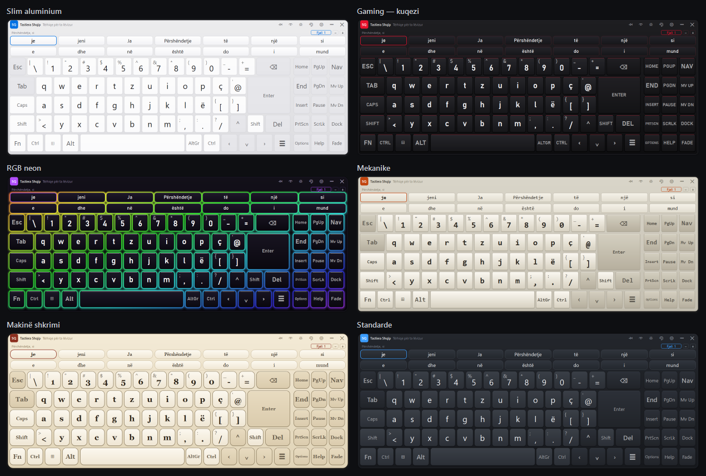
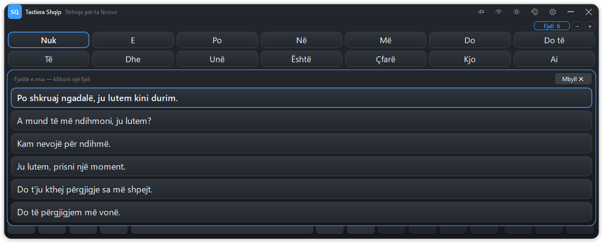

# Tastiera Shqip — Albanian on-screen keyboard with word prediction

A Windows on-screen keyboard for Albanian that types into **any** application and
predicts both the word being written and the word that comes next. It is built
for people who type slowly or with difficulty, where every keystroke saved is
the point.


## What it does

**Types everywhere.** Keystrokes are injected with `SendInput`, so Word, Chrome,
Outlook, WhatsApp Desktop, Notepad and the rest all receive ordinary keyboard
input. The keyboard never takes focus (`WS_EX_NOACTIVATE`), so the text cursor
stays where you are writing.

**Writes Albanian without the Albanian layout.** Characters are sent as Unicode
rather than as layout-dependent key codes, so **Ë** and **Ç** come out correctly
even on a machine set to the US layout.

**Predicts words and next words.** A trigram model trained on ~30 million words
of Albanian offers completions as you type and predicts the following word after
each space, across one to three rows of suggestions.

**Adapts to you.** Every word you write is folded into a personal model, so your
name, your town and the phrases you use most rise to the top. It is stored only
on your machine, in `%APPDATA%\ShqipKeyboard`, and can be erased from Options.

**Goes where you want it.** Drag the top strip to move it, drag any edge or
corner to resize it, double-click the strip to dock or release it. Adjustable
text size and opacity, and the suggestion buttons zoom from the bar itself.

**Looks how you want it.** Six keyboard designs — plain, slim aluminium, red and
black gaming, backlit RGB, deep mechanical, and a typewriter — each with a dark
and a light variant, switchable at any moment from the header or from Options.

**Opens immediately.** The window is on screen in under half a second; the
dictionary loads behind it and the suggestions light up when it is ready.

## Accessibility

| Feature | Why it is there |
|---|---|
| **Dwell selection** | Rest the pointer on a key and it presses itself — no click needed. For head mice, eye trackers and joysticks. |
| **Sticky modifiers** | Shift/Ctrl/Alt/AltGr latch: press once for the next key, twice to lock, three times to release. Ctrl+C with one finger. |
| **Caps Lock that behaves** | Caps Lock reaches letters only — the comma key still types a comma — and Shift inverts it rather than adding to it. |
| **Two words in one press** | When the following word is near-certain — `do të`, `mund të`, `për shkak të` — it comes bundled into the same suggestion. Albanian is full of these. |
| **Sentences that cost one press** | The full stop closes up the space auto-space left, puts the space after itself back in, and the next letter is capitalised. That boundary used to cost four presses and now costs one. |
| **Whole sentences in one press** | The `Fjali` button opens a sheet of complete sentences over the keys. One click writes the whole thing, however long. Everything you finish is remembered and offered back — 5× to 23× on a sentence you have written before. |
| **Hold to repeat** | Holding Backspace deletes continuously instead of demanding forty clicks. The delay before it starts and how many repeats a second are both adjustable, and it can be switched off entirely if tremor sets it going by accident. |
| **No diacritics needed** | `shqiperi` offers `Shqipëri`. Hunting for Ë costs a slow typist real time. |
| **Typo tolerance** | A doubled or transposed letter still finds the word — the errors tremor produces. |
| **One to three prediction rows** | More rows means more words offered without hunting; fewer means less of the screen taken. Yours to choose. |
| **Suggestions sized separately** | Predictions are read, not aimed at from memory; someone who enlarged the keys to hit them may want the words smaller to see more at once. `−` and `+` sit on the bar itself, so it can be changed mid-sentence. |
| **Light variant of every design** | An opaque dark slab over a white document is tiring to read past, and higher contrast suits some low-vision users — so no design is dark-only. |
| **Four accent colours** | The accent marks hover, press and dwell progress — load-bearing signals somebody with colour vision deficiency may not otherwise distinguish. |
| **Adjustable size, opacity, dwell time** | All in Options. Legends shrink to fit their key, so a large text size does not clip `Options` to `Optio`. |

## Requirements

- Windows 10 or 11
- Python 3.10+

## Install and run

```powershell
pip install -r requirements.txt
python main.py
```

The keyboard docks to the bottom of the screen. It has no taskbar button; use
the tray icon near the clock to show it again after hiding, or to quit.

## Layout

The layout follows the Albanian (sq-AL) QWERTZ standard shown below: **Y and Z
swapped** relative to QWERTY, **Ç** to the right of P, **Ë** to the right of L,
and the 102nd `<`/`>` key beside the left Shift.

```
Esc  \| 1! 2" 3# 4$ 5% 6^ 7& 8* 9( 0) -_ =+  ⌫      Home PgUp Nav
Tab  q w e r t z u i o p ç @'          Enter        End  PgDn Mv Up
Caps a s d f g h j k l ë [{ ]}                      Ins  Pause Mv Dn
Shift <> y x c v b n m ,; .: /?  ⌃ Shift Del        PrtScn ScrLk Dock
Fn Ctrl ⊞ Alt [    space    ] AltGr Ctrl ‹ ⌄ › ☰    Options Help Fade
```

`Fn` swaps the number row for F1–F12. `Dock` pins the keyboard to the bottom or
lets it float, `Mv Up`/`Mv Dn` move it clear of what you are writing, `Fade`
makes it translucent, and `Nav` hides the right-hand pane.

## Moving and resizing

- **Move** — drag the strip along the top. Dragging a docked keyboard releases
  it; a plain click never does, so a mistimed press cannot knock it loose.
- **Resize** — drag any edge or corner. A docked keyboard spans the screen, so
  only its top edge (its height) is yours to change.
- **Dock / release** — double-click the top strip, or use ◧.
- The header also carries ◑ fade, ☀ light/dark, ◈ next design and ⚙ Options.

Position and size are remembered between sessions, and a window left off-screen
by a since-unplugged monitor is pulled back into view on the next start.

## Designs

Six of them, chosen from **Options → Pamja → Dizajni i tastierës** or stepped
through with ◈ on the header. Each carries a dark and a light variant, so the
theme button keeps working whichever one is on.



| Design | What it looks like |
|---|---|
| **Standarde** | The plain one. The only design that takes your accent colour, since the others need their own. |
| **Slim aluminium** | Flat, barely-shaded keys set well apart, thin lettering. Silver in light, graphite in dark. |
| **Gaming — kuqezi** | Red on black, tight square keys, condensed capitals on the named keys. |
| **RGB neon** | Dark caps lit from underneath, the colour drifting across the board as a slow diagonal wave. The legends stay white — the light is in the gaps, and never touches the thing you have to read. Freeze the drift in Options if it distracts; the colours stay. |
| **Mekanike** | Deep moulded caps, heavy shadow, monospaced legends. Beige PBT in light. |
| **Makinë shkrimi** | Cream round caps, serif legends, dark red accent; black bakelite body in dark. |

A design is a `Skin` in [`osk/ui/theme.py`](osk/ui/theme.py): two palettes plus
the corner radius, key spacing, shading depth, shadow, edge light, border width,
typeface and weight. Adding one is a single entry in `SKINS` — no new painting
code, because the painters read all of it from the current skin.

### What the backlight costs

Lighting each key from the key itself is the obvious implementation and it is
unaffordable: 83 keycaps are 83 widgets, and repainting them all came to ~55 ms
a frame — half a core, on a keyboard that sits on screen all day.

[`osk/ui/backlight.py`](osk/ui/backlight.py) does it as one layer instead. The
blooms are traced into a mask once per layout; each frame is then a single
linear gradient composited through that mask. The part that actually matters is
that the lit region is cut back to *outside* every keycap — Qt repaints a widget
whenever the damaged region touches it, so one pixel of clearance is the
difference between repainting nothing and repainting all 98 widgets.

Measured on an idle window, 4-second samples, at ten frames a second:

| | CPU |
|---|---|
| any design without a backlight | 0.0% of one core |
| RGB, drift frozen | 0.0% |
| RGB, drift running | **1.6%** |

Ten frames a second sounds far too few until you notice that nothing moves —
only the colour changes, about three degrees of hue per frame, which is below
what the eye resolves.

The designs are written for this program and drawn in the manner of keyboards
people recognise. They carry no brand's name, marks or artwork, and are not
affiliated with or endorsed by anyone.

## How prediction works

Trigram, bigram and word-frequency estimates are **interpolated**, each weighted
by how much evidence stands behind it, and both queries — completing a word and
predicting the next one — are answered from that single distribution.

- **While typing a word**, candidates matching the prefix are ranked by how
  common they are *and* by how well they follow the previous two words. After
  `shumë`, typing `mir` puts `mirë` first.
- **After a space**, the next word is predicted outright from the preceding two.
- **Context stops at the full stop.** After `Shkova në shtëpi. ` the question
  asked is what usually *opens* a sentence, not what follows `shtëpi`.
- **Lookup ignores diacritics**, so undiacriticised input still finds its
  n-grams: `eshte` resolves to `është` before the continuation is looked up.
- **Recently written words are favoured.** Roughly half the time the n-gram
  tables have nothing to say about the next word; people write about one subject
  at a time, so what was typed a moment ago is the best signal left.
- **Your own words are layered on top**, weighted above the general corpus.

Accepting a suggestion is expressed as an edit — *delete N characters, type
this* — so a prediction that is not a literal extension of what you typed
(`shqiperi` → `Shqipëri`) still lands correctly.

### Two words in one press

Albanian runs on a small number of very frequent two-word chunks. When the model
is at least 35% sure of the word after the one it is offering, that word comes
bundled in: `do të`, `mund të`, `duhet të`, `nuk është`, `për shkak të`,
`në lidhje me`. A third word is added if the next step is just as confident.

The threshold is the whole design. Measured over the 300 commonest words, 35%
fires on about one context in ten and produces the chunks above; lower starts
bundling guesses, and a wrong second word costs a slow typist far more to delete
than the right one saved. Bundled suggestions sit **immediately after** the word
they extend rather than at the end of the list — the far corner of the last row
is the most expensive button on the keyboard — and they displace at most three
of the lowest-ranked single words.

The engine keeps a shadow copy of recent text, since there is no dependable way
to read the caret's surroundings from an arbitrary application. That copy is
discarded when focus changes, when you click into a document, or when a
navigation key moves the caret — stale context predicts worse than none.

### Whole sentences, and why they are recalled rather than generated



The `Fjali` button on the suggestion bar opens a sheet of complete sentences
over the keys. One click writes the whole sentence and the sheet closes itself.
The number on the button says how many are waiting, so it is never opened blind.

Everything finished with `.`, `!`, `?` or **Enter** is remembered — the Enter
case is what catches an address line or an email sign-off, which end in no
punctuation at all. Typing the first two or three letters narrows the sheet, so
`Fal` reaches *Faleminderit shumë për ndihmën.* and, since matching folds away
the diacritics, `pers` reaches *Përshëndetje…*. The sentence written most
recently comes first: people repeat what they said a minute ago far more than
what they said last month. About 37 everyday sentences ship with it — requests
for help, greetings, replies — so the sheet is useful before it has learned
anything, and they drop below the user's own sentences as soon as those arrive.

**The model does not write these.** That was measured, not assumed. Sweeping a
greedy chain through the shipped n-gram model with the confidence floor from
0.40 down to 0.20 produces a three-word run for **1%** of contexts and a
five-word run for **none** — and lowering the bar makes it fire more often on
the same one- and two-word chunks rather than producing longer ones. What it
does generate from a standing start is corpus-average filler (*nuk e di se
çfarë do të…*): grammatical, and almost never the sentence that was meant. So
generation stops where the phrase feature stops, at two or three words, and the
sentence sheet is built on the one source of whole sentences that is reliably
right — the ones this person has already written.

Sentences containing a run of six or more digits are never stored. A card
number, a code or a telephone number is exactly what must not be learned and
then displayed on a keyboard somebody else can see; a year or a house number is
not a secret and is kept.

### Two decisions worth knowing about

**Evidence is weighted, not ranked.** An earlier version took the highest-order
n-gram that matched and ignored the rest. On this corpus 71% of trigram contexts
were seen with exactly one continuation, so their probability came out as 1.0 and
beat every bigram however well attested — a trigram seen twice overrode a bigram
seen a hundred thousand times. Each order now contributes in proportion to how
often its context was actually observed.

**A truncated list is not a complete one.** Only the commonest continuations of
each context are stored. A word missing from that list is not impossible after
the context, so it receives its share of the probability the list does not
account for, rather than zero.

## Measured accuracy

Scored on ~58,000 words of Albanian held out of training (one sentence in 200,
never trained on), against the previous algorithm retrained on the identical
data so the comparison is of methods, not of corpora:

| | before | now |
|---|---|---|
| next word, top 1 | 18.4% | **19.0%** |
| next word, top 7 (one row) | 36.9% | **38.4%** |
| next word, top 21 (three rows) | 42.0% | **48.2%** |
| word completed from 2 letters, top 1 | 19.1% | **36.7%** |
| word completed from 2 letters, top 7 | 39.7% | **52.1%** |
| **keystrokes saved** | 47.3% | **49.6%** |

Next-word prediction is a genuinely hard problem and the gain there is modest;
the large one is in completing a word once a letter or two has been typed, which
is where a slow typist spends most of their keystrokes. Three rows of
suggestions raise the chance of the word being on screen from 38% to 48%.

Reproduce with:

```powershell
python tools/evaluate.py --model osk\prediction\data\model_sq.pkl.gz `
  --holdout corpora\heldout.txt
```

## What actually makes a pointer user faster

Keystrokes saved is the wrong unit for someone aiming with one finger and a
mouse. A press on a chip 1,700 px away is not the same purchase as one on the
key next door, and the bill is paid in travel, not in presses. Ranking the
options therefore means costing them in **time**: Fitts' law over the real
on-screen rectangles, plus the cost of reading the suggestion row.

The three inputs that are measurements are the key and chip geometry (dumped
from a running window), Albanian word frequencies (the shipped model), and the
prediction hit rates above. The pointer and reading constants are modelled, so
every figure below is a *ratio* between two policies costed with identical
constants, and each was checked against a sweep of those constants.

| change | faster by |
|---|---|
| the sentence-boundary fixes together | **+6%** |
| — of which: closing up the space before the full stop | +4% |
| — of which: the automatic capital after it | +2% |
| bundling a confident second word into the suggestion | **+2 to +5%** |
| **both, as shipped** | **+8 to +11%** |
| putting the best guess in the middle of the row, not the left end | +2% |
| a narrower window, or clustering the chips together | ~0% |

The range on the bundling is the honest one. A confident continuation exists for
about one context in ten, and it is right roughly half the times it fires — so
it absorbs something like 5% of words, not the 15% that a first pass assumed.
Bundling would be worth +13% if it fired three times as often, and it does not.

The first two are now in the keyboard. The last two are not, and the reasons
are worth recording:

**Resizing the keyboard changes nothing.** Fitts' law is scale-invariant —
shrink the distance and the target together and the time is identical. A bigger
keyboard is easier to *hit*, which matters, but it is not faster.

**The best guess is still at the left end.** Moving it to the middle measured
2–3% in every sweep, but the model prices travel and not reading, and it cannot
see the cost of breaking left-to-right order in a row people read. That is a
change worth trying against a real user rather than against a spreadsheet.

The row-count question — one row, two or three — came out differently depending
on how fast the reader is assumed to be, from +14% for one row to −15%. The
model cannot settle it, which is exactly why it stays a setting.

### The ceiling on all of this, and the one way past it

Every row of that table is a percentage, and that is not an accident. Word
prediction charges **one press per word** no matter how good it gets; a perfect
model still leaves a fourteen-word sentence costing fourteen trips across the
board. Tuning the ranking moves single-digit percentages because single-digit
percentages are all that is there.

The only change of a different order is to stop paying by the word. A sentence
recalled whole costs two presses whatever its length, so the saving grows with
the sentence instead of being capped by it:

| sentence | typed out | recalled | ratio |
|---|---|---|---|
| 5 words | 13.7 s | 2.4 s | **5.7×** |
| 8 words | 21.9 s | 2.4 s | **9.1×** |
| 12 words | 32.9 s | 2.4 s | **13.7×** |
| 20 words | 54.8 s | 2.4 s | **22.9×** |

Same Fitts constants as the table above, same board; the sentence route — the
`Fjali` button, then a panel row — was measured off a running window, and the
figures include reading the rows before choosing.

That only applies to a sentence you have written before. Across everything you
write, the speed-up depends on how much of it repeats:

| share of writing that repeats | overall speed-up |
|---|---|
| 20% | 1.2× |
| 50% | 1.9× |
| 80% | 3.9× |
| 90% | 6.1× |
| 95% | 8.4× |
| 99% | 12.3× |

So **10× is reachable, but only for writing that is about 97% repetition** —
routine replies, standing answers, forms, the same daily messages. For prose
being composed for the first time there is no 10×, from this or from anything
else: the sentence has to be specified somehow, and specifying it is the cost.
The honest summary is that this keyboard is now roughly 10% faster on new prose
and between five and twenty times faster on anything said before.

The remaining lever on the sentence route is that it costs two presses — the
button, then the row. Getting it to one, by putting a very confident sentence
match directly on the suggestion row, is worth about another 40% of the recall
cost and is not built.

## Retraining the model

The shipped model (`osk/prediction/data/model_sq.pkl.gz`, 16 MB, 186k words,
102k bigram and 831k trigram contexts) was built from Albanian OpenSubtitles,
news and Wikipedia text — 29.5 million words:

```powershell
python tools/train.py --out osk\prediction\data\model_sq.pkl.gz `
  --leipzig corpora\sqi_news_2020_300K.tar.gz `
  --leipzig corpora\sqi_wikipedia_2021_300K.tar.gz `
  --plain   corpora\opensubtitles_sq.txt.gz `
  --freq    corpora\sq_50k.txt `
  --holdout corpora\heldout.txt
```

Sources: [Leipzig Corpora](https://wortschatz.uni-leipzig.de/en/download/Albanian),
[OPUS OpenSubtitles](https://opus.nlpl.eu/OpenSubtitles.php),
[FrequencyWords](https://github.com/hermitdave/FrequencyWords).

`--plain` accepts any one-sentence-per-line text, so you can train on material
closer to what a particular user writes. `--holdout` withholds one sentence in
200 so `tools/evaluate.py` can score the result on text it has not seen; without
it a better number may only mean the model memorised the test.

The trainer makes three passes over a cached, pre-tokenised copy of the corpus —
words, then bigrams, then trigrams — so only one n-gram table is in memory at a
time. `BIGRAM_CAP` and `TRIGRAM_CAP` bound that; peak use is near 1.2 GB.

## Tests

```powershell
python tests/test_prediction.py
python tests/test_keys.py
```

80 tests over tokenisation, completion, next-word prediction, n-gram
interpolation, diacritic folding, typo tolerance, sentence-boundary context,
the recency cache, personal learning, the bundled two-word suggestions, and the
sentence bank — including that a sentence carrying a long run of digits is never
written to disk, and that accepting one replaces what was typed rather than
being appended to it.

39 more over the layout and the designs: what character each key produces under
Shift, AltGr and Caps Lock, the latching modifiers, and every skin — including a
contrast check that each design keeps its legends at least 4.5:1 against its own
keycaps, since a keyboard that looks striking but cannot be read has failed at
the only thing it is for.

Thirteen of those thirty-nine drive the controller through a stand-in for
`SendInput` and assert on the text that would have reached the application:
`3.14` keeps its decimal point, a space the user typed is never removed, and an
automatic capital never overrides Shift. Those decisions are made a few
microseconds before the characters leave for the operating system, so that is
the only level at which they can be checked at all.

## Layout of the source

```
main.py                     entry point, tray icon, background model loading
osk/
  config.py                 settings, persisted as JSON
  controller.py             key press -> injected input; sticky modifiers
  layouts/albanian.py       the sq-AL layout and its key geometry
  prediction/
    engine.py               typing context, recency cache, ranking, accept plan
    model.py                n-gram tables, interpolation, prefix search, folding
    userstore.py            the personal, adaptive model
    sentences.py            whole sentences: learning, ranking, the bundled set
    tokens.py               tokenisation and sentence splitting, shared with the trainer
  ui/
    window.py               the keyboard window: painting, moving, resizing
    keycap.py               one drawn key: click, hold-repeat, dwell
    keypanel.py             unit-grid layout
    suggestbar.py           the grid of prediction chips, with its own zoom
    sentencebar.py          the whole-sentence sheet that opens over the keys
    backlight.py            the RGB skin's light, as one masked layer
    options.py              Options and Help dialogs
    theme.py                palettes, the six skins, stylesheet, drawn icons
  winapi/
    sendinput.py            SendInput: Unicode text and virtual-key chords
    focus.py                no-focus-stealing window styles, focus tracking
    hooks.py                notices clicks that move the caret elsewhere
tools/
  train.py                  builds the language model from corpora
  evaluate.py               scores it on held-out text
```

## Privacy

Everything stays on the machine. The personal dictionary and the sentence store
are local JSON files under `%APPDATA%\ShqipKeyboard`; nothing is transmitted
anywhere. The mouse hook inspects only *where* a click landed, never what is
typed, and there is no keystroke logging of any kind.

The sentence store holds whole sentences rather than isolated words, so it is
treated with more care than the dictionary: a sentence containing a run of six
or more digits is never recorded, and both stores can be emptied from Options —
the words under **Parashikimi i fjalëve**, the sentences under **Fjalitë e
plota**. Turning off *Mëso nga fjalët që shkruaj* stops both.
